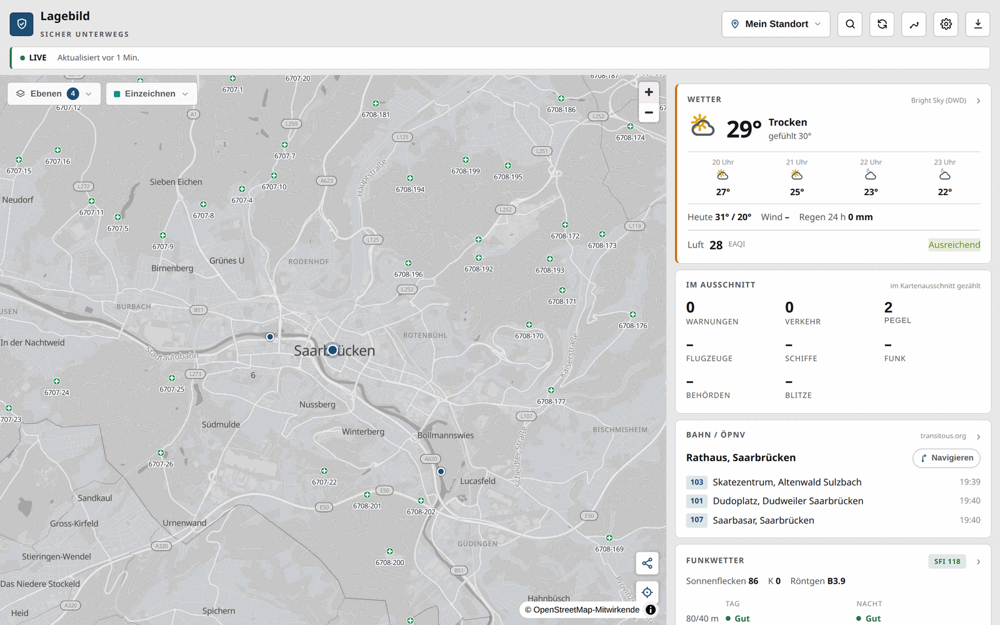
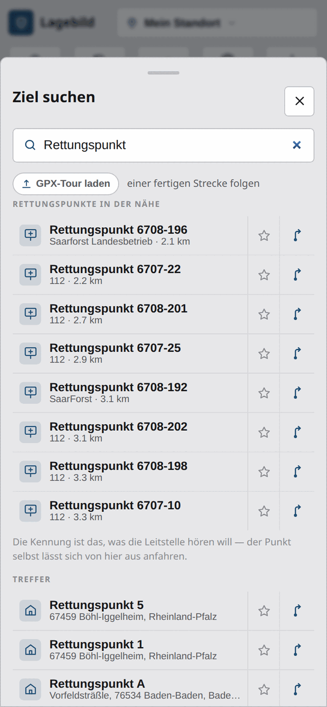
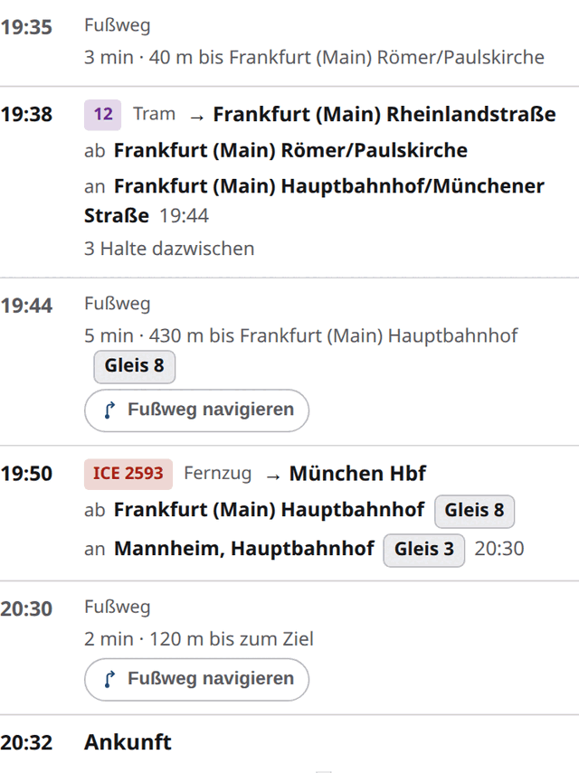
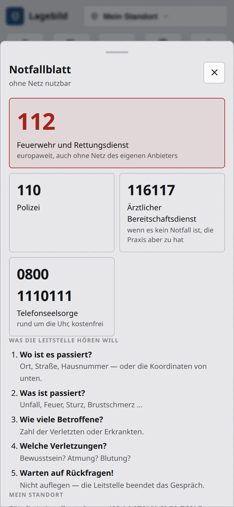
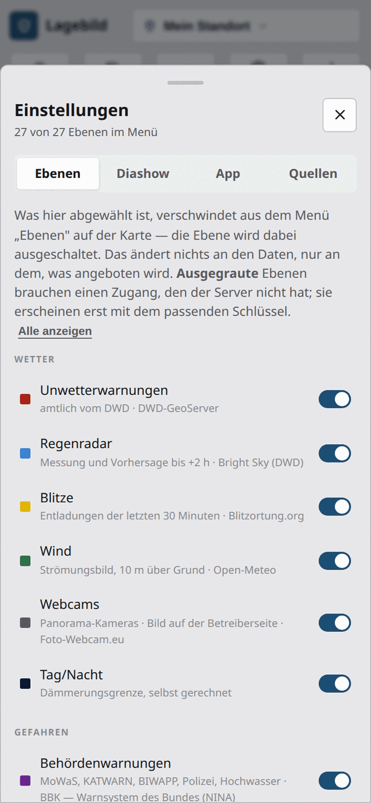

<div align="center">

# Lagebild

**Wetter, amtliche Warnungen, Verkehr und Nachrichten auf einer Karte —
und alles, worauf es ankommt, auch ohne Netz.**

[](https://github.com/FelixLenz-Code/lagebild/actions/workflows/ci.yml)
[](LICENSE)


</div>



## Worum es geht

Wer draußen unterwegs ist, braucht selten *eine* Information — sondern das
Zusammenspiel: Zieht das Gewitter über den Grat? Steht die Bahn? Warnt der
Katastrophenschutz gerade? Und wie komme ich hier weg, wenn das Netz weg ist?

**Lagebild** legt diese Dinge übereinander auf eine Karte und macht die
wichtigsten davon **offline verfügbar**. Route, Suche, Höhenprofil und
Notfallblatt rechnen ausschließlich auf dem Gerät — es gibt keinen
Routing-Dienst im Hintergrund, der ausfallen könnte. Pro Bundesland lädt man
dafür einmal ein Paket herunter.

Fokus ist Deutschland, Quellen sind überwiegend amtlich (DWD, BBK/NINA,
Autobahn GmbH, PEGELONLINE, BfS) oder frei (OpenStreetMap, transitous.org).
Kein Konto, keine Anmeldung, keine Tracker.

## Was drin ist

- 🗺️ **37 Kartenebenen** — Unwetter- und Behördenwarnungen, Regenradar mit
  Vorhersage bis +2 h, Wind, Pegel mit Einstufung, Verkehr, Blitze, Lawinenlage,
  Flugzeuge, Schiffe, Waldbrandgefahr, Polarlicht, Rettungspunkte, Löschwasser,
  Drohnen-Zonen, Blaulicht-Meldungen, BOS-Luftfahrzeuge …
- 🧭 **Navigation komplett offline** — Auto, Rad, zu Fuß, mit Abbiegeverboten,
  deutschen Ansagen, bis zu drei Varianten, Zwischenzielen und Höhenprofil
- 🔎 **Suche ohne Netz** — Adressen mit Hausnummer, Orte, Punkte („Apotheke"),
  Koordinaten in fünf Schreibweisen, dazu **Rettungs- und Notfallpunkte**
- 🚆 **ÖPNV mit Gleisangabe** — Verbindungen von transitous.org, jede Fahrt mit
  Ein- und Ausstieg, Steig und kurzfristigem Gleiswechsel
- 🎯 **Eine bestimmte Fahrt verfolgen** — „RE 1", „25 ab Domsheide" oder
  „ICE 611" eingeben; die Suche geht je nach Kürzel im Umkreis, in der Region
  oder bundesweit. Die gewählte Fahrt bleibt danach mit Position, Verspätung,
  nächstem Halt und ganzem Laufweg auf der Karte — auf Wunsch folgt die Karte
- 🆘 **Notfallblatt** — Nummern, die fünf W-Fragen, der eigene Standort in der
  Schreibweise der Leitstelle, nächste Anlaufstellen **nach Fahrzeit** statt
  Luftlinie. Ohne Netz, druckbar
- ⏱️ **Erreichbarkeit** — wie weit man in 15, 30 oder 60 Minuten kommt, aus dem
  Routing-Paket im Gerät gerechnet; dazu **Schattenwurf** des Geländes zu jeder
  Uhrzeit und ein **Wetterfenster-Finder** für die nächsten trockenen Stunden
- ☣️ **Gefahrgut** — orangefarbene Tafel eintippen, Absperrradius und Fahne
  stromab auf der Karte, **Betroffenenzahl** aus dem Zensus-Gitter und von dort
  direkt in die Fluchtroute
- 📓 **Einsatz-Logbuch** — nur während eines Einsatzes, ein Logbuch je Einsatz;
  Ereignisse mit Uhrzeit, als Text oder GeoJSON weiterzugeben
- ✏️ **Einzeichnen und Messen** — Punkte, Linien, Flächen, GPX/KML/GeoJSON
  einlesen, Spur aufzeichnen, Karte als Link teilen
- 📻 **Funkwetter** — MUF-Karte, Bandampel für eine Strecke, APRS-Ziele
- 📱 **Installierbare PWA** — läuft im Browser, auf dem Homescreen und als
  Diashow auf einem Lagemonitor

## Ein Blick hinein

| | |
| --- | --- |
|  |  |
| **Rettungspunkte suchen.** Das Wort genügt, die Kennung vom Schild auch („DA-703", „4915"). Betreiber, Entfernung, und von hier direkt anfahrbar. | **ÖPNV mit Steig.** Jede Fahrt nennt Ein- und Ausstieg mit Gleis; ein kurzfristiger Wechsel steht durchgestrichen daneben. |
|  |  |
| **Notfallblatt.** Nummern, die fünf W-Fragen und der eigene Standort so, wie die Leitstelle ihn hören will. Funktioniert ohne Netz. | **Jede Ebene nennt ihre Quelle.** Was man nicht braucht, verschwindet aus dem Menü — die Karte bleibt lesbar. |

## Zwei Gestalten, nicht eine gestauchte

Am Rechner stehen Karte und Kacheln nebeneinander. Auf schmalen Geräten
(unter 900 px) ist die App **keine zusammengeschobene Schreibtisch-Ansicht**,
sondern hat einen eigenen Aufbau: schlanke Kopfzeile mit Ort, die Karte über
die ganze Fläche, und unten eine Leiste — **Karte · Suche · Lage · ÖPNV ·
Mehr**. Die Karte bleibt dabei immer eingehängt; die anderen Reiter legen sich
darüber, damit Ausschnitt und Ebenen beim Wechseln erhalten bleiben.

„Lage" und „ÖPNV" sind dort eigene Seiten und zeigen mehr als die Kachel: die
Warnungen im Klartext, alle Halte in der Nähe mit ihren Abfahrten. Unter „Mehr"
liegt, was am Rechner in der Kopfzeile steht — Notfallblatt, Kompass, Spur,
Teilen, Offline-Regionen, Einstellungen.

## Auf einem Server installieren

Ein Befehl richtet ein und aktualisiert — dasselbe Skript für beides:

```bash
curl -fsSL https://raw.githubusercontent.com/FelixLenz-Code/lagebild/main/install.sh | bash
```

Wer nicht gern ein Skript aus dem Netz in eine Shell schüttet (guter Reflex),
lädt es erst herunter und liest es:

```bash
curl -fsSL https://raw.githubusercontent.com/FelixLenz-Code/lagebild/main/install.sh -o install.sh
less install.sh
bash install.sh
```

Der Installer führt durch die ganze Einrichtung und legt an: `/opt/lagebild` mit
Quellcode und gebautem Bundle, einen Systemnutzer `lagebild` ohne Login, und den
Dienst `lagebild.service` (Start beim Hochfahren, Neustart nach Absturz). Er
fragt dabei die drei optionalen Schlüssel und das Passwort ab — vorhandene Werte
zeigt er maskiert, Enter behält sie, ein `-` löscht sie. Fehlt eine
Voraussetzung (`git`, `curl`, `tar`, Node.js 20+, pnpm), bietet er an, sie zu
installieren. Gebraucht werden Linux mit systemd und root oder `sudo`.

Zum Schluss fragt er, **welche Offline-Pakete gebaut werden sollen** — Karte,
Routing und Suche, Höhen, Einwohner, je Bundesland. Er zeigt vorher, was schon
da ist, was es an Platz kostet und wie lange es dauert, prüft Platz und
Arbeitsspeicher und baut Land für Land weiter, wenn eines scheitert. Danach
läuft die App auch ohne Netz.

Die **Kartenpakete sind keine reine Offline-Zugabe**: Die Basiskarte kommt
grundsätzlich vom eigenen Server. Ist eine Region im Gerät, liest die App sie
von dort; sonst holt sie sich aus derselben Datei auf dem Server per HTTP-Range
nur die Kacheln, die der Ausschnitt braucht. Liegt für die Gegend gar kein
Paket, bleibt die grobe Weltkarte (`00`) — und ohne jedes Paket bleibt die
Fläche leer, während die Fachebenen darüber weiter erscheinen.

**Beim zweiten Aufruf ist es ein Updater**: neuen Stand holen, bauen, Dienst
durchstarten. Schlüssel, Passwort und fertige Offline-Pakete bleiben
unangetastet, die Abfrage dient dann zum Ändern. Scheitert der Bau oder startet
der Dienst nicht, bietet er den Rückweg auf den vorherigen Stand an.

| | |
| --- | --- |
| Zustand | `systemctl status lagebild` |
| Protokoll | `journalctl -u lagebild -f` |
| Konfiguration | `/opt/lagebild/apps/api/.env` |
| Nur Pakete bauen | `bash install.sh pakete` |
| Anderes Ziel | `LAGEBILD_DIR=/srv/lagebild bash install.sh` |
| Ohne Rückfragen | `LAGEBILD_LAENDER="04 11" LAGEBILD_PAKETE=alle bash install.sh` |

TLS gehört davor in einen Reverse-Proxy — sonst geht `APP_PASSWORD` im Klartext
über die Leitung.

## Loslegen (Entwicklung)

```bash
pnpm install
cp apps/api/.env.example apps/api/.env     # optionale Schlüssel, Passwort
pnpm dev                                   # API :8787 + Web :5173
```

Danach http://localhost:5173 öffnen. Ohne jeden Schlüssel läuft alles außer
Verkehrsfluss (TomTom), Schiffen (aisstream.io) und Amateurfunk (aprs.fi) —
diese Ebenen blenden sich von selbst aus.

```bash
pnpm build          # alle Pakete bauen
pnpm typecheck      # Typprüfung
pnpm check          # Prüfläufe ohne Daten und ohne Netz
```

## Offline-Pakete

Die Offline-Fähigkeit hängt an Dateien je Bundesland, die der Browser über den
„Offline"-Knopf in den OPFS lädt:

| Datei | Inhalt | Bremen | Hessen |
| --- | --- | --- | --- |
| `<code>.pmtiles` | Hintergrundkarte (Vektorkacheln) | 22 MB | — |
| `<code>.route` | Routing-Graph mit Abbiegeverboten | 1,9 MB | 35 MB |
| `<code>.search` | Suchindex: Orte, Straßen, POIs, Hausnummern | 1,6 MB | 18 MB |
| `<code>.terrain` | Höhenraster für Profil und Höhenlinien | 0,2 MB | 4 MB |
| `<code>.pop` | Einwohner im 100-m-Gitter | 0,1 MB | 0,8 MB |
| `00.pmtiles` | grobe Weltkarte, füllt beim Herauszoomen | 15 MB | — |

Auf einem Server nimmt einem das der Installer ab — er fragt Länder und
Paketarten ab und baut sie:

```bash
bash install.sh pakete
```

Von Hand geht es genauso, ein Skript je Art:

```bash
scripts/build-routing.mjs           # alle 16 Länder (lädt die OSM-Auszüge)
scripts/build-routing.mjs 04 11     # nur einzelne (Ländercode)
scripts/build-maps.sh 00 04 11      # Hintergrundkarten dazu (00 = Weltkarte)
scripts/build-terrain.mjs 04        # Höhendaten für Profil und Höhenlinien
scripts/build-population.mjs 04     # Einwohner (braucht das Zensus-Gitter)
```

Gebaut wird aus den Geofabrik-Auszügen und dem jüngsten Protomaps-Planetbau;
der API-Server liefert die fertigen Dateien unter `/api/maps` aus. Große Länder
brauchen beim Routing eine halbe Stunde und mehrere GB Heap — das Skript startet
sich dafür selbst neu. Die Dateien sind gitignored.

## Datenquellen

| Thema | Quelle | Zugang |
| --- | --- | --- |
| Wetter, Vorhersage, Regenradar | Bright Sky / DWD | frei |
| Unwetterwarnungen | DWD-GeoServer | frei |
| Behördenwarnungen | BBK / NINA | frei |
| Pegelstände | PEGELONLINE (WSV) | frei |
| Verkehrsmeldungen, Rastplätze | Autobahn GmbH | frei |
| Bahn / ÖPNV, Haltestellen, Fahrzeuge | transitous.org (MOTIS) | frei |
| Karte, Routing, Suche, Rettungspunkte, Löschwasser | OpenStreetMap (+ Overpass) | ODbL |
| Einwohner im 100-m-Gitter | Zensus 2022 (Destatis) | dl-de/by-2-0 |
| Gefahrgut: Leitfäden und Abstände | ERG 2024 (US DOT) | gemeinfrei |
| Drohnen-Zonen (§ 21h LuftVO) | dipul (DFS) | dl-de/by-2-0 |
| Luftqualität, Wind | Open-Meteo | frei |
| Strahlung (ODL) | Bundesamt für Strahlenschutz | frei |
| Waldbrandgefahr, Pollen | DWD | frei |
| Lawinenlage | EAWS-Warndienste | frei |
| Blitze | Blitzortung.org | frei |
| Erdbeben | USGS | gemeinfrei |
| Funkwetter, Polarlicht | NOAA SWPC | gemeinfrei |
| Satellitenfeuer | NASA FIRMS | frei |
| Flugzeuge, BOS-Luftfahrzeuge | adsb.fi, adsbdb.com | frei |
| Nachrichten | Tagesschau | frei |
| Blaulicht-Meldungen | Presseportal (news aktuell) | frei, nur Anriss + Link |
| Verkehrsfluss | TomTom | `TOMTOM_KEY` |
| Schiffe (AIS) | aisstream.io | `AISSTREAM_KEY` |
| Amateurfunk (APRS) | aprs.fi | `APRSFI_KEY` |

## Grundsätze

- **Offline zuerst.** Was im Ernstfall zählt, darf nicht am Netz hängen.
  Routing, Suche, Höhenprofil und Notfallblatt rechnen auf dem Gerät.
- **Nichts erfinden.** Fehlt eine Angabe, bleibt die Zeile leer — statt eine
  plausible Zahl hinzuschreiben. Jede Ebene nennt ihre Quelle und ihr Alter.
- **Farbe ist nie die einzige Information.** Warnstufen, Verkehrsmittel und
  Zustände stehen zusätzlich im Klartext.
- **Rücksicht auf gespendete Dienste.** Serverseitiger Cache, gerasterte
  Anfragen, keine Abrufe für ausgeschaltete Ebenen.
- **Kein Konto, keine Tracker.** Der Server ist ein zustandsloser Proxy;
  eigene Daten (Markierungen, Ziele, Spuren) bleiben im Browser.

## Aufbau

Monorepo mit pnpm-Workspaces, durchgehend TypeScript:

| Paket | Zweck |
| --- | --- |
| `apps/web` | React-PWA (Vite, MapLibre). Karte, Kacheln, Offline-Worker. |
| `apps/api` | Hono-Proxy. Normalisiert Quellen, umgeht CORS, cached kurz. |
| `packages/shared` | Gemeinsame Datentypen. |
| `scripts` | Paketbau (Routing, Karten, Gelände) und Prüfläufe. |

Statt eines Testrahmens liegen die Prüfungen als eigenständige Node-Skripte
bei — sie lesen dieselben Module wie die App:

| Befehl | prüft | braucht |
| --- | --- | --- |
| `pnpm check:import` | GPX/KML/KMZ/GeoJSON-Leser, Maße | nichts |
| `pnpm check:auth` | Passwortschutz, Bremse, Cookie | nichts |
| `pnpm check:offline` | Graph, Router, Suchindex | gebautes Regionspaket |
| `pnpm check:via` | Zwischenziele, Nähte, Ausweichkanten | gebautes Regionspaket |
| `pnpm check:terrain` | Höhenraster gegen bekannte Höhen | gebautes Höhenpaket |

## Konfiguration

Alles über `apps/api/.env` (Vorlage: `.env.example`):

| Variable | Wirkung |
| --- | --- |
| `APP_PASSWORD` | Gemeinsames Passwort vor `/api/*`. Leer = offen. Nur mit HTTPS sinnvoll. |
| `CACHE_TTL_SECONDS` | Wie lange Proxy-Antworten frisch bleiben (Standard 300). |
| `WEB_ROOT` | Gebautes PWA-Bundle, das der Server mit ausliefert. |
| `MAPS_DIR` | Ablage der Offline-Pakete für `/api/maps`. |
| `TRUST_PROXY` | Wem `X-Forwarded-For`/`-Proto` glauben: leer = niemandem, IP/CIDR-Liste = nur von dort, `1` = jedem. **Steht ein Proxy davor, gehört seine Adresse hier hinein** — sonst teilen sich alle Nutzer eine Absenderkennung (ein Fremder sperrt mit fünf falschen Passwörtern jeden aus) und das Anmelde-Cookie bekommt kein `Secure`. `1` nur, wenn der Port ausschließlich über den Proxy erreichbar ist. |
| `CORS_ORIGINS` | Fremde Herkünfte für den Browser-Zugriff, Komma-Liste. Leer = keine (richtig, solange die Oberfläche vom selben Server kommt). |
| `TOMTOM_KEY`, `AISSTREAM_KEY`, `APRSFI_KEY` | Schalten die jeweilige Ebene frei. |
| `VITE_MAP_PMTILES_URL` | Feste Basiskarte (Bauzeit), etwa eine eigene Deutschland-PMTiles. Ohne die Angabe nimmt die App die Dateien aus `MAPS_DIR` — die zum Standort passende, per HTTP-Range gelesen. |

Das Passwort sperrt **nur den Server**, nie das Gerät: Ein Netzfehler ändert
nichts, entsperrt bleibt entsperrt — sonst stünde man ohne Empfang vor einem
Passwortfeld, obwohl alle Daten längst im Gerät liegen.

## Betrieb von Hand

Für alles außer Linux-mit-systemd (oder wenn der Installer nicht passt): Ein
einziger Hono-Prozess liefert API **und** PWA-Bundle aus, zustandslos.

```bash
pnpm build
pnpm start                              # WEB_ROOT muss auf apps/web/dist zeigen
```

TLS gehört davor in einen Reverse-Proxy — `APP_PASSWORD` geht sonst im Klartext
über die Leitung.

## Hinweis zur KI-Unterstützung

Diese Software wurde vollständig mithilfe von Claude (einem KI-Assistenten von
Anthropic) entwickelt. Der Autor hat die Anforderungen definiert, Entscheidungen
getroffen und das Ergebnis geprüft — der Code selbst wurde durch den Dialog mit
der KI generiert.

## Haftungsausschluss

Die Software wird so bereitgestellt, wie sie ist (as-is), ohne jegliche Garantie
auf Korrektheit, Vollständigkeit oder Eignung für einen bestimmten Zweck. Der
Autor übernimmt keinerlei Haftung für Schäden, Datenverluste oder sonstige
Probleme, die durch die Verwendung dieser Software entstehen. Die Nutzung
erfolgt auf eigene Verantwortung.

Das gilt ausdrücklich auch für die angezeigten Daten: Warnungen, Wetter, Pegel,
Verkehr und Fahrpläne stammen von Dritten, können verspätet, unvollständig oder
falsch sein. **Diese App ist kein Ersatz für die amtlichen Warnkanäle** und
keine Grundlage für Entscheidungen über Leib und Leben. Im Notfall gilt die 112.

## Lizenz

© 2026 Felix Lenz.

Dieses Projekt steht unter der
[PolyForm Noncommercial License 1.0.0](LICENSE). Du darfst es nutzen, ändern
und weitergeben, solange es **nicht kommerziell** geschieht und der Urheber
genannt bleibt. Den vollständigen Text findest du in [LICENSE](LICENSE) sowie
unter <https://polyformproject.org/licenses/noncommercial/1.0.0/>.

Die **Daten** gehören ihren Quellen und stehen unter deren eigenen Bedingungen —
Karte, Routing und Suche stammen aus OpenStreetMap (© OpenStreetMap-Mitwirkende,
[ODbL](https://opendatacommons.org/licenses/odbl/)).
